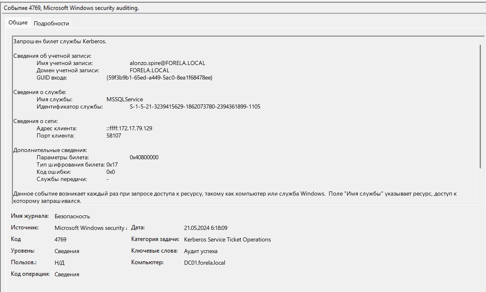
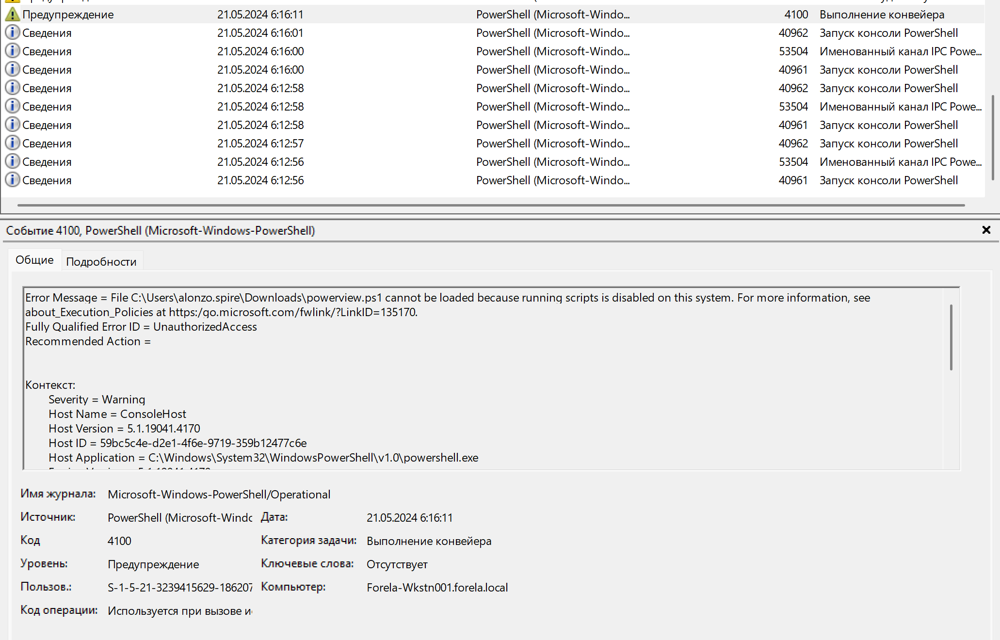
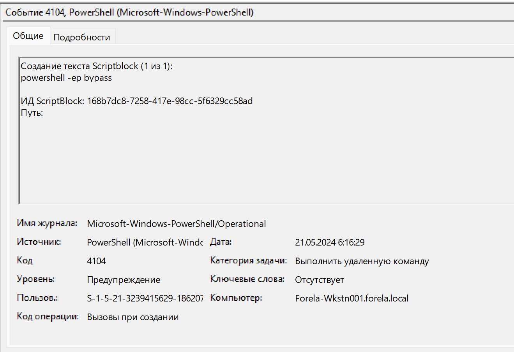
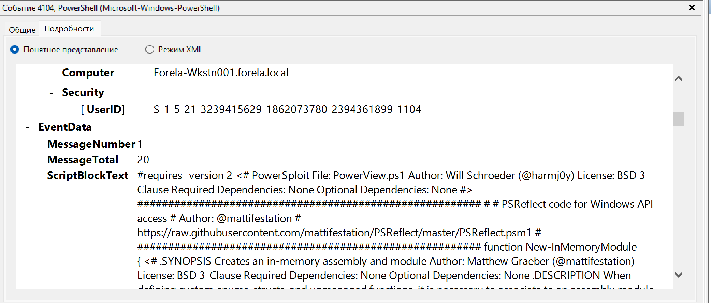
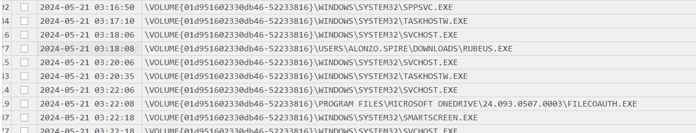
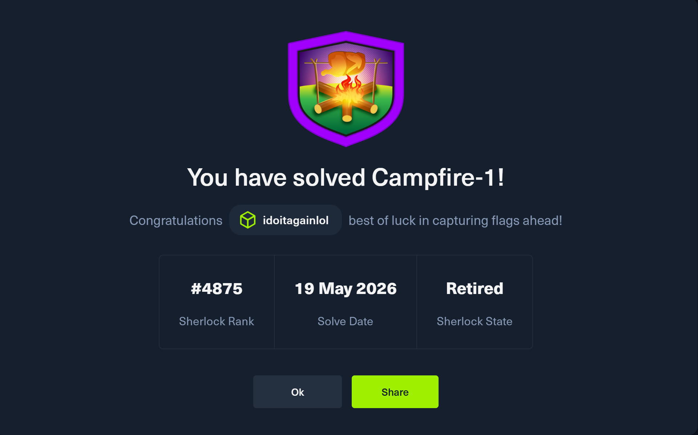

# Campfire-1

#### Сценарий
Алонзо заметил странные файлы на своём компьютере и сообщил об этом недавно сформированной команде SOC. После оценки ситуации предполагается, что в сети могла произойти атака **Kerberoasting**. Ваша задача — подтвердить эти выводы, проанализировав предоставленные доказательства.

Вам предоставлены:
1. **Журналы Security** с контроллера домена
2. **Журналы PowerShell-Operational** с заражённой/затронутой рабочей станции
3. **Prefetch-файлы** с заражённой/затронутой рабочей станции

#### Задание 1
Анализируя журналы безопасности контроллера домена, можете ли вы подтвердить дату и время по UTC, когда произошла атака Kerberoasting?

Ответ:

Анализируя журналы безопасности DC, вижу большое количество событий  EventId=4769 и EventId=4771. 

Когда возникает событие **4769**? Это событие запроса сервисного билета Kerberos. Когда пользователь уже получил TGT и хочет обратиться к какому-то сервису, он запрашивает у контроллера домена **TGS**, то есть сервисный билет.
В нем нас интересуют сервисные учетные записи + тип шифрования.

| Тип шифрования тикета | Значение     | Комментарий по типу шифрования               |
| ---------------------- | ------------ | -------------------------------------------- |
| `0x11`                 | AES128       | Более современный вариант                    |
| `0x12`                 | AES256       | Более современный и предпочтительный вариант |
| `0x17`                 | RC4-HMAC     | Старый и более рискованный вариант           |
| `0x18`                 | RC4-HMAC-EXP | Ещё более старый/слабый вариант              |

Когда возникает событие **4771**? Событие появляется на DC, когда учетка пытается получить TGT от KDC, но предварительная проверка Kerberos не прошла.

В итоге находим событие, которое больше всего нам подходит.



#### Задание 2
Какое имя службы было целью атаки?

Ответ: Информация о службе находится в том же событии из Задания1 в разделе "сведения о службе"

#### Задание 3
Очень важно определить рабочую станцию, с которой произошла эта активность. Какой IP-адрес рабочей станции?

Ответ:

Заходим в раздел "Подробности" того же события из Задания1 и там будет поле IpAddress.

#### Задание 4
Теперь, когда мы определили рабочую станцию, вам предоставлены материалы для первичного анализа, включая логи PowerShell и Prefetch-файлы, чтобы глубже понять, как эта активность произошла на конечном устройстве.

Как называется файл, который использовался для перечисления объектов Active Directory и, возможно, поиска учётных записей, уязвимых к Kerberoasting, в сети?

Ответ:

В логах PowerShell видим следующее: Сначала был запуск самой консоли PowerShell, далее - в событии EventId=4100 была неудачная попытка запуска скрипта. 



Что делает злоумышленник дальше?
С помощью команды `powershell -ep bypass` он разрешает запуск любых скриптов PS. 


Далее - перезапуск консоли и выполнение PS-кода, состоящего из 20 частей.

Название скрипта находится в ScriptBlockText


#### Задание 5
Указано в событии 4104 `Создание текста Scriptblock (1 из 20)`

#### Задание 6
Какой полный путь к инструменту, который использовался для выполнения самой атаки Kerberoasting?

Ответ:

Разберем файлы, которые помогают системе быстрее запускать программы (prefetch), с помощью инструмента **PECmd** от Eric Zimmerman. Для этого используем команду команду:
```
PECmd.exe -d "..\campfire-1\Triage\Workstation\2024-05-21T033012_triage_asset\C\Windows\prefetch" --csv . --csvf result.csv
```

Далее открываем полученный файл в программе **Timeline Explorer**.

В Timeline Explorer проверяем исполняемые файлы, которые запускались примерно в тот временной промежуток, который мы определили ранее. 



#### Задание 7
Когда был запущен инструмент для дампа учётных данных? Укажите время в **UTC**.

Ответ: Находится на скриншоте выше.

