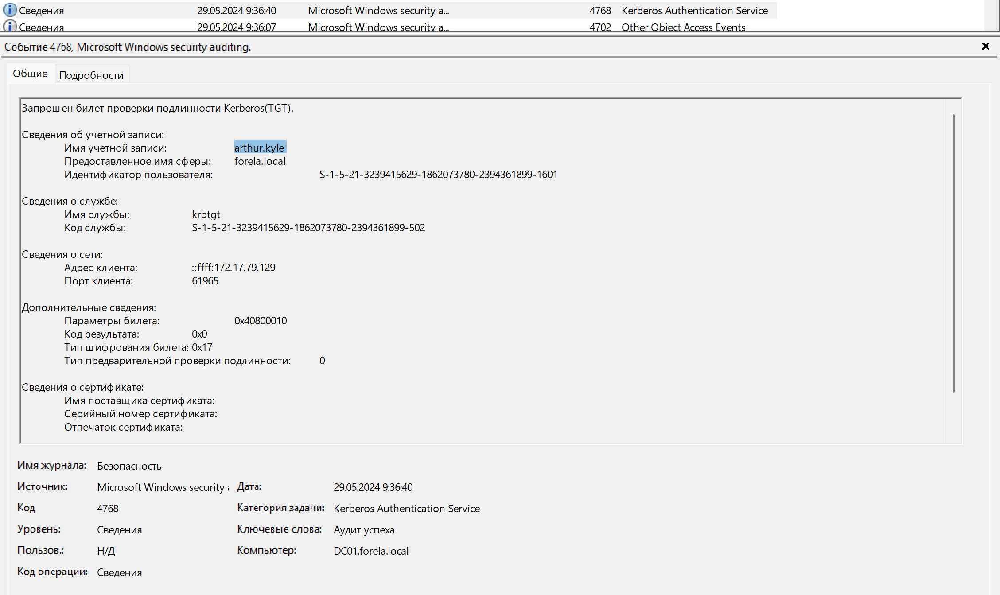
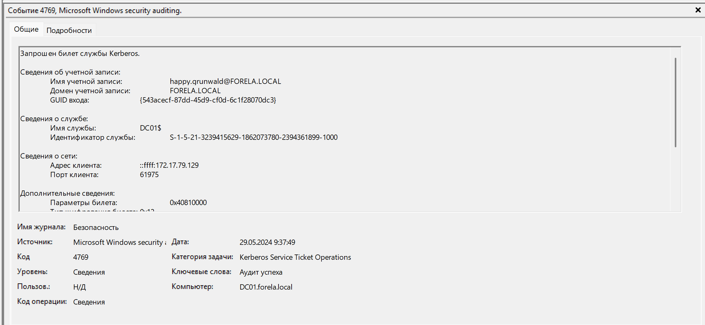
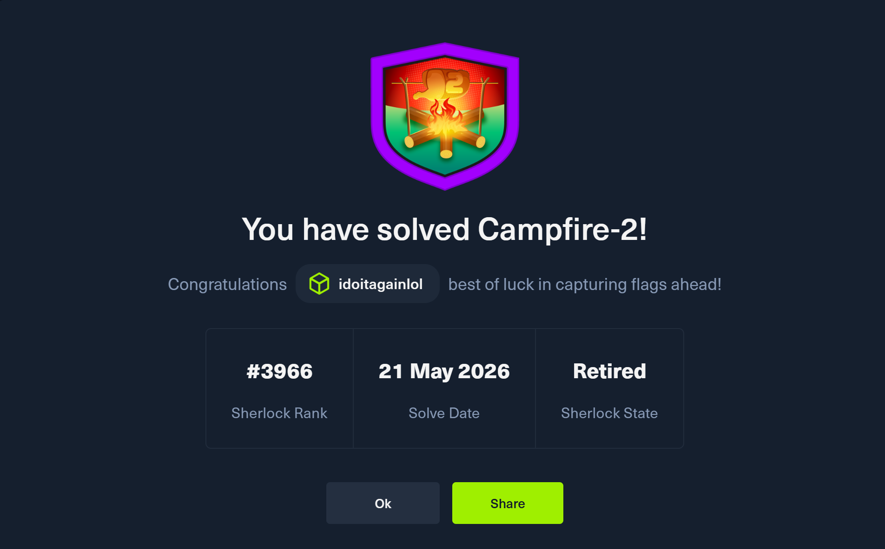

# Campfire-2

### Сценарий
Сеть Forela постоянно подвергается атакам. Система безопасности подняла тревогу из-за того, что старая административная учётная запись запросила билет у KDC (Key Distribution Center) на контроллере домена. Инвентаризация показывает, что эта учётная запись сейчас не используется, поэтому вам поручено разобраться в ситуации. Это может быть атака типа *AS-REP Roasting*, так как любой пользователь может запросить билет для учётной записи, у которой отключена предварительная аутентификация (preauthentication).
 
### Задание 1
Когда произошла атака AS-REP Roasting, и когда злоумышленник запросил Kerberos-билет для уязвимого пользователя?

Ответ:

Нужно просмотреть события с EventId=4768. Особое внимание также стоит уделить типу шифрования, конкретно интересует `0x17`/`0x18`.

А вот и нужное событие:

### Задание 2
Пожалуйста, подтвердите, какая учётная запись пользователя была целью злоумышленника.

Ответ:

Учетка также указана на скрине выше.

### Задание 3
Какой SID был у этой учётной записи?

Ответ:

SID также указан на скрине.

### Задание 4
Крайне важно определить скомпрометированную учётную запись пользователя и рабочую станцию, ответственную за эту атаку. Пожалуйста, укажите внутренний IP-адрес скомпрометированного хоста, чтобы помочь нашей TI-команде.

Ответ:

Ответ находится в группе "Сведения о сети", поле "Адрес клиента". 

### Задание 5
У нас пока нет никаких артефактов с исходной машины. Используя те же логи контроллера домена, можете подтвердить, какая учётная запись пользователя использовалась для выполнения атаки AS-REP Roasting, чтобы мы могли изолировать скомпрометированную учётную запись или учётные записи?

Ответ:

Буквально следующее событие сигнализирует нам об учетной записи атакующего (в частности из-за того, что эта учетка используется на скомпроментированной тачке).

