#### Сценарий
IDS-система предупредила нас о возможном несанкционированном устройстве во внутренней сети Active Directory. IDS также указала на признаки LLMNR-трафика, что является необычным. Предполагается, что произошла атака LLMNR poisoning.

LLMNR-трафик был направлен на Forela-WKstn002, у которого IP-адрес 172.17.79.136. Вам, как нашему эксперту по сетевой форензике, предоставлен ограниченный сетевой дамп пакетов за период, близкий ко времени инцидента.

Поскольку это произошло в VLAN Active Directory, рекомендуется провести сетевой TI с учётом вектора атаки на Active Directory, уделяя особое внимание LLMNR poisoning.

### Задание 1
Команда безопасности подозревает, что во внутренней сети Forela находилось несанкционированное устройство, на котором был запущен инструмент Responder для проведения атаки LLMNR Poisoning.
Пожалуйста, найдите IP-адрес этой машины.

Ответ:

Окей, так как нас заранее предупредили, что это точно атака LLMNR Poisoning, значит нужно сначала найти DNS запросы, которые сервер не смог разрешить, и сразу за этими запросами искать LLMNR-трафик.

А вот как раз и запросы, которые DNS не смог разрешить:
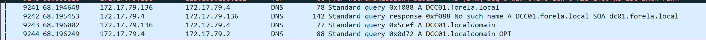

Мультикаст DNS:
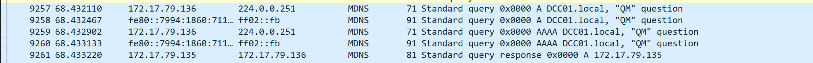

Переход к запросу на разрешение в LLMNR:
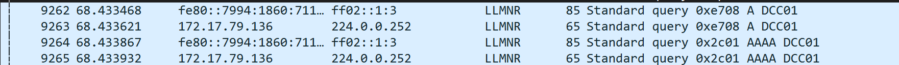

А вот и ответ с хоста: 
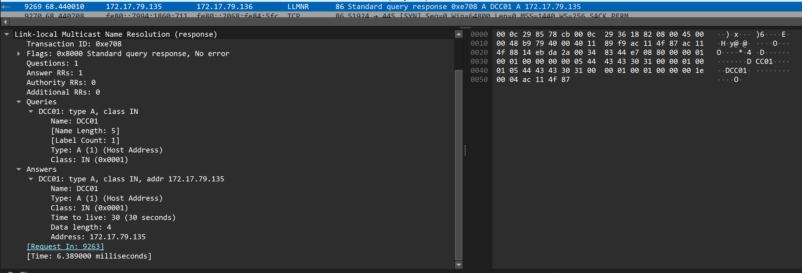

### Задание 2
Какое имя хоста у несанкционированного устройства?

Ответ:

Имя хоста мы можем определить по определенным полям в пакетах с протоколом DHCP, конкретно нас интересует поле `Host Name`:
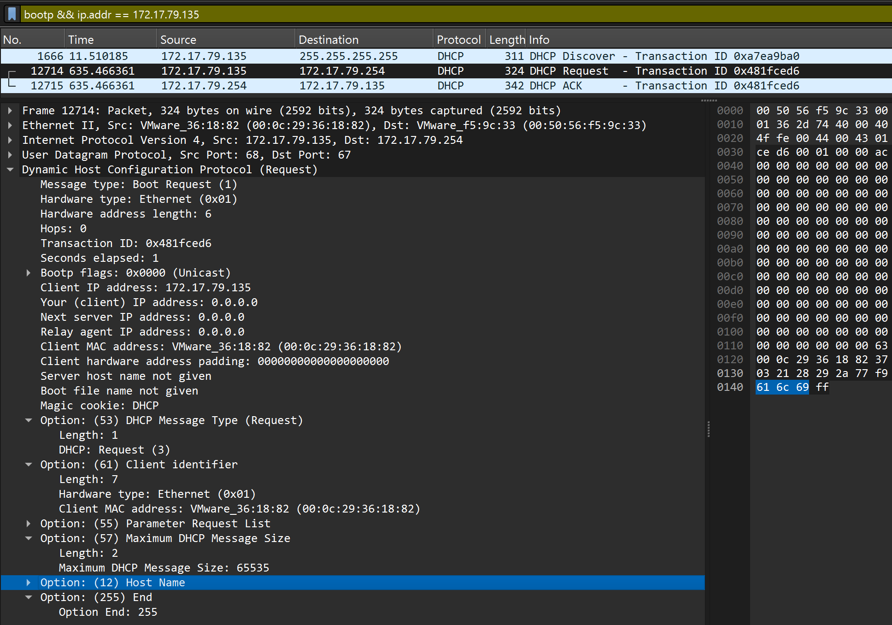

### Задание 3
Теперь нам нужно подтвердить, смог ли атакующий захватить хэш пользователя и можно ли его взломать.
Какое имя пользователя у учётной записи, хэш которой был захвачен?

Ответ:

Если мы говорим про NTLM-аутентификацию, то она состоит из 3 шагов: `NEGOTIATE/CHALLENGE/AUTH`. 
Нас будет интересовать сообщение `AUTH`, так как именно в нем содержится имя пользователя, рабочей станции и прочие поля.

Посмотрим на NTLMSSP-сообщения:
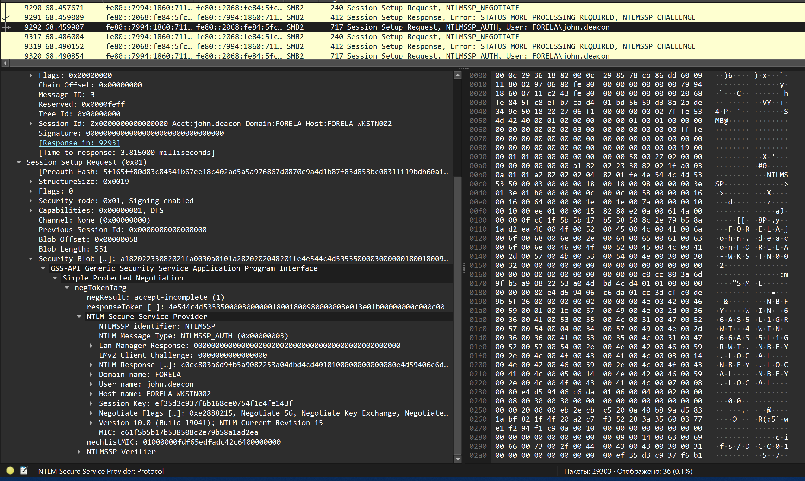

### Задание 4
В NTLM-трафике видно, что учётные данные жертвы несколько раз передавались на машину атакующего.
Когда хэши были захвачены в первый раз?

Ответ:

Мы должны найти самое первое `NTLMSSP_AUTH` сообщение, далее `Frame -> UTC Arrival Time.

### Задание 5
Какую опечатку допустила жертва при переходе к файловому ресурсу, из-за чего её учётные данные были скомпрометированы?

Ответ: 

Думаю, что жертва пыталась обратиться к файловому ресурсу и ошиблась в имени сервера, отправив запрос к `DCC01`. 

### Задание 6
Чтобы получить реальные учётные данные пользователя-жертвы, нам нужно собрать вместе несколько значений из пакетов NTLM negotiation.
Какое значение имеет **NTLM server challenge**?

Ответ:

Так как NetNTLMv2-хэш это набор значений в результате NTLM-обмена, а не поле из одного пакета, придется смотреть на все отправленные пакеты при NTLM-обмене.

Правда, в задании нам облегчили поиск и попросили  указать значение только из сообщения `NTLMSSP_CHALLENGE`:
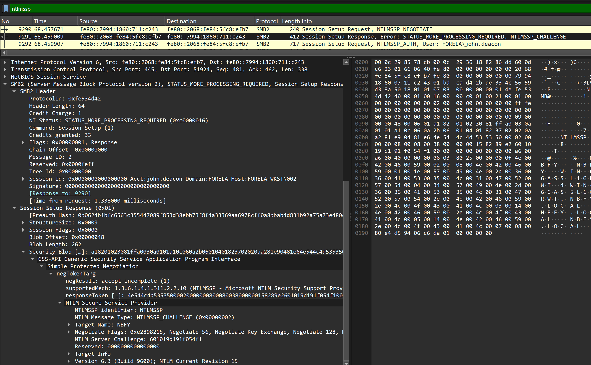

### Задание 7
Теперь, сделав аналогичное действие, найдите значение **NTProofStr**.

Ответ: 

Для поиска `NTProofStr` нужно перейти к сообщениям `NTLMSSP_AUTH`:
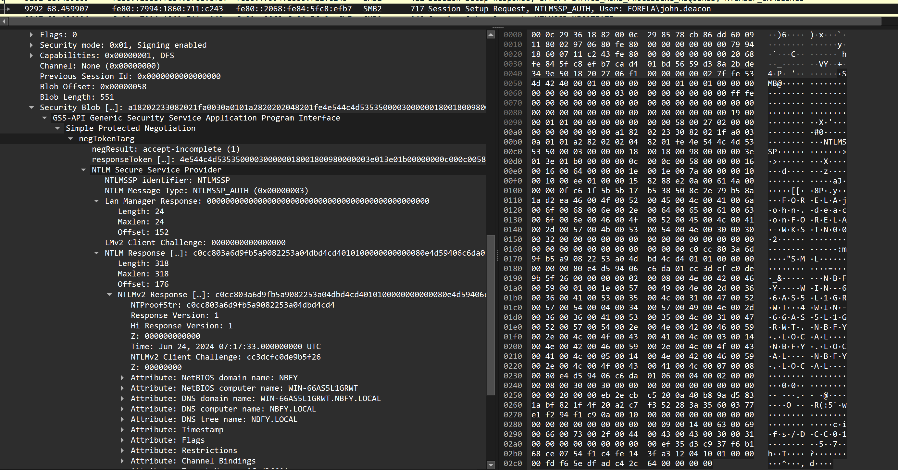

### Задание 8
Чтобы проверить сложность пароля, попробуйте восстановить пароль, используя информацию, найденную в сетевом дампе пакетов.
Это важный шаг, поскольку таким образом мы можем определить, смог ли атакующий взломать этот хэш и насколько быстро он мог это сделать.

Ответ:

Погуглив, какой формат нужно передать на вход hashcat, приходим к выводу, что он должен быть таким:
`username:domain:server_challenge:NTProofStr:blob`

Ранее мы уже нашли username, domain, server_challenge и NTProofStr, то есть остался только blob.

blob можно найти в пакете NTLMSSP_AUTH, в поле `NTLMv2 Response`, которое состоит из `NTProofStr + blob`. Т.е. все, что идет после значения NTProofStr является `blob`.

Собираем воедино и прогоняем через hashcat:
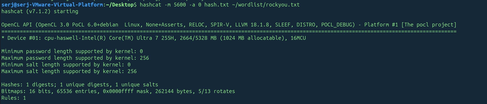

### Задание 9
Просто для получения дополнительного контекста по инциденту: к какому реальному файловому ресурсу пыталась перейти жертва?

Ответ:

Через фильтр в Wireshark: `smb2.cmd == 3`,он покажет SMB-команды `TREE_CONNECT`.
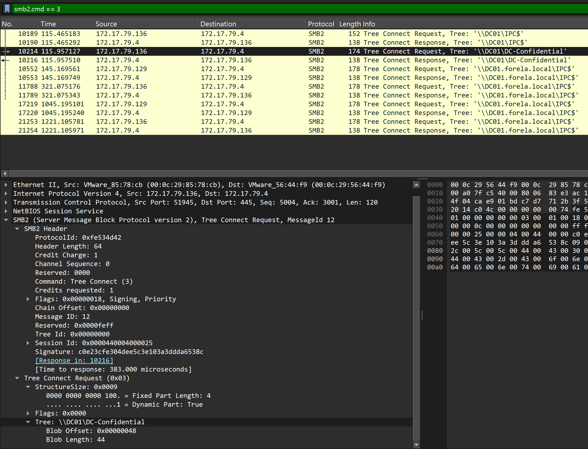

Congrats:
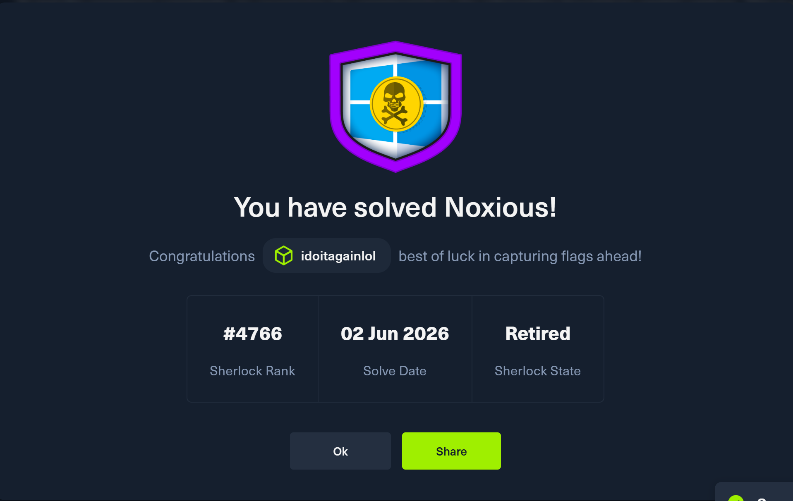