#### Сценарий
Наша SIEM-система сгенерировала оповещение о подозрительном событии входа в систему, которое необходимо немедленно проверить. В деталях оповещения было указано, что IP-адрес и имя исходной рабочей станции не совпадают.

Вам предоставлены сетевой дамп и журналы событий за период, близкий ко времени инцидента. Сопоставьте предоставленные доказательства и подготовьте отчет для вашего SOC-менеджера.
## Разбор pcap-файла
Начну разбор с pcap файла. В самом начале файла вижу, что было подключение от нового устройства: на это указывают пакеты с протоколом DHCP.
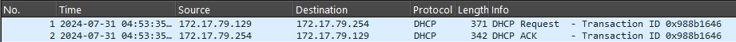

Далее идет пакет с протоколом NetBIOS Name Service, в котором идет обновление регистрации NetBIOS имени в сети:

Окей, связываю IP 172.17.79.129 с именем рабочей станции FORELA-WKSTN001.

Далее вижу ARP-сканирование от IP 172.17.79.135:
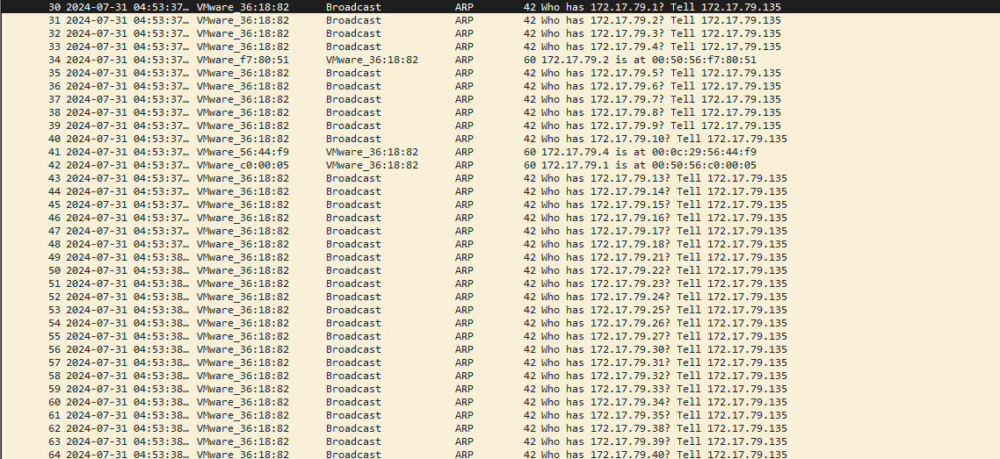

Заинтересовала активность с этого IP-шника и решил проверить дополнительно, что он делает.

После ARP-сканирования, данный хост определил существующие устройства и решил узнать их имена через обратные DNS-запросы:
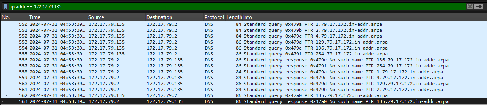

Далее видно соединение к серверу по IP-адресу 172.17.79.4 по открытому порту 445 (обычно это порт SMB сервиса):
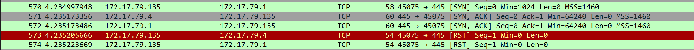

Также было соединение к IP 172.17.79.129 также по порту 445.

Вижу обновление имени FORELA-WKSTN002 с IP 172.17.79.136:
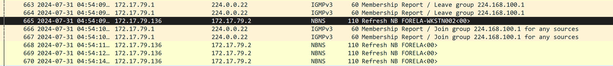

Потом запрос на резолв к DNS-серверу и дальнейший ответ от DNS, что такого имени не существует:
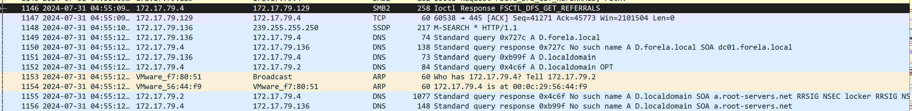

Так как DNS не смог зарезолвить, то подключается mDNS, а потом и LLMNR, но важная деталь: ответил не настоящий сервер, а IP, который ранее проводил сканирование:
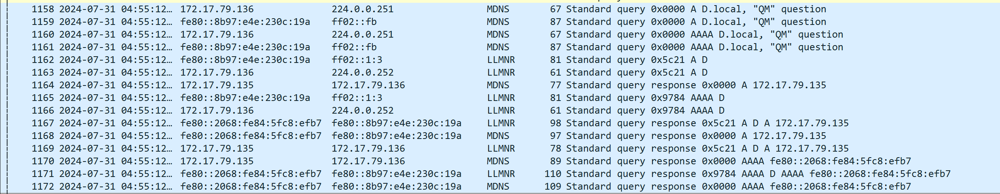

Потом 172.17.79.136 пытается подключиться к злоумышленнику по SMB, включается Kerberos-аутентификация, но она неуспешна, так как Key Distribution Center не знает такого имени сервиса:
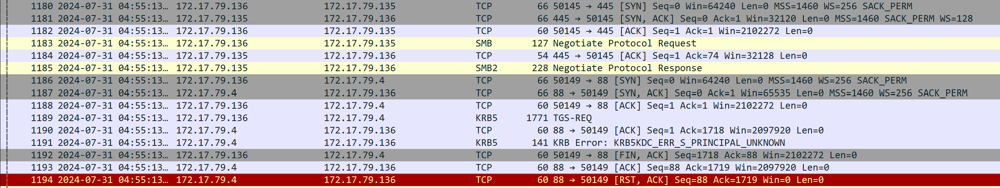

И начинается NTLM-аутентификация:
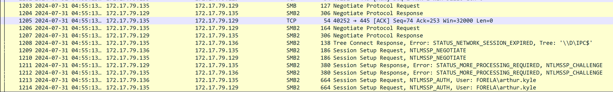

В пакете с номером 1214 видно, что злоумышленник передает аутентификацию на сервер 172.17.79.129.

Далее видно 2 подключения: жертва пытается подключиться к ресурсу \\D\IPC$, отправляя свои данные злоумышленнику, а злоумышленник подключается к другой тачке: 
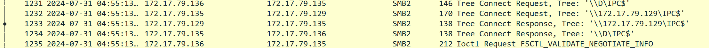

Далее злоумышленник пытается открыть удаленный диспетчер служб, но ему не хватает прав для управления службами (WERR_ACCESS_DENIED):
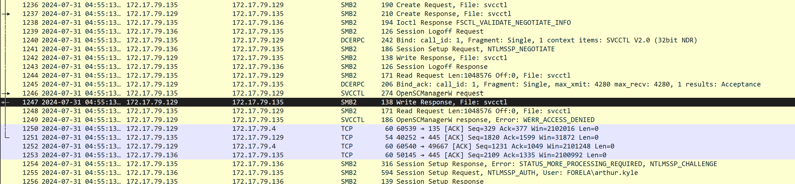

Потом идет отключение от 172.17.79.129 и начинается соединение между жертвой и 172.17.79.4:
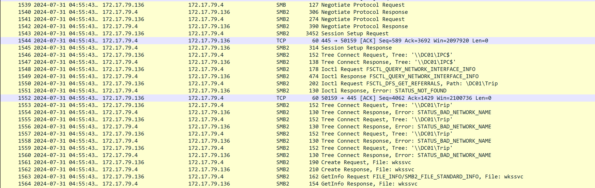

Чтобы ответить на остальные вопросы лабораторной работы, дальше нужно просмотреть события из файла Security.evtx.

Для этого нужно детально рассмотреть событие с id 4624 из файла. Нас будут интересовать входы с учетной записи arthur.kyle.
Касательно полей:
- IpPort
- TargetLogonId
- WorkstationName
- IpAddress
- 
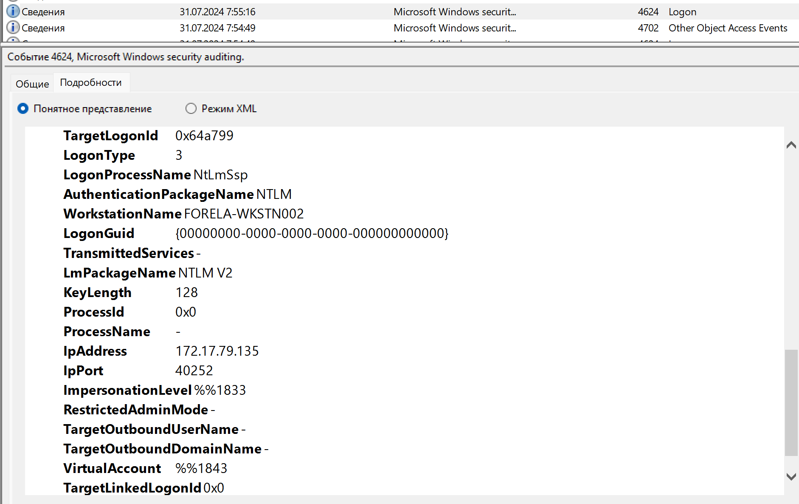

Чтобы ответить на вопрос: Какое имя сетевой шары было запрошено в рамках процесса аутентификации вредоносным инструментом, который использовал злоумышленник?

Нужно посмотреть событие 5140 (Получен доступ к объекту сетевой папки). Внутри него интересующее нас поле: ShareName

Congrats!
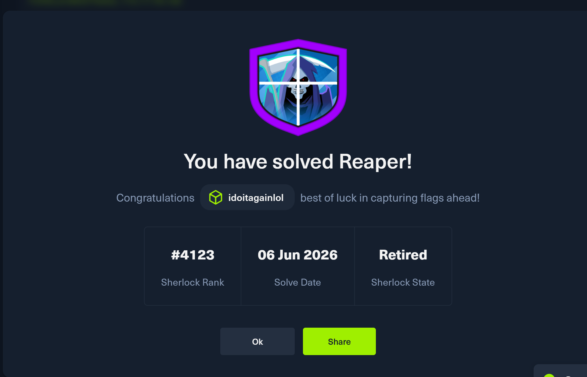

